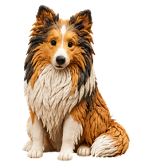
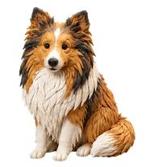
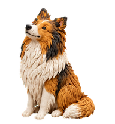

# Codex Avatars

Custom claymation pets and emote packs for [Codex](https://openai.com/codex) and ChatGPT Pets.

Right now the pack is **Flame** — a sable-and-white Sheltie rendered as stop-motion clay, built from a real photo.

<p>
  
  
  
</p>

Flame has 13 expressions (including a howl), looping emotes, and — on desktop — 16 looking directions plus a paw-wave hover greeting.

## Which download?

| I want… | Get this |
| --- | --- |
| Codex / ChatGPT **desktop** pet (looks around + paw greet) | [**flame-v2.zip**](https://github.com/banterle-hash/codex-avatars/releases/latest/download/flame-v2.zip) |
| ChatGPT **web** upload (or older desktop hosts) | [flame-pet-share.zip](https://github.com/banterle-hash/codex-avatars/releases/latest/download/flame-pet-share.zip) |
| Avatar, emotes, and the in-browser gallery | [flame-avatar-pack.zip](https://github.com/banterle-hash/codex-avatars/releases/latest/download/flame-avatar-pack.zip) |

Web and desktop do **not** sync. Install each surface separately.

## Desktop install (Codex)

1. Download **flame-v2.zip** and extract it.
2. Copy the whole `flame` folder to `~/.codex/pets/`  
   (or `$CODEX_HOME/pets/` if you set a custom home).  
   Back up any existing `flame` folder first.
3. You should have:

   ```text
   ~/.codex/pets/flame/pet.json
   ~/.codex/pets/flame/spritesheet.webp
   ```

4. **Settings → Pets → Refresh**, then choose **Flame**.
5. Type `/pet` to wake him.

## ChatGPT web

1. Download and extract **flame-pet-share.zip**.
2. **Settings → Personalization → Pet → Upload pet**.
3. Upload `flame/spritesheet.webp` — the image, not the ZIP.

Pets must be enabled on the account. Official docs: [ChatGPT Pets](https://learn.chatgpt.com/docs/pets).

## Expressions

| Expression | What you see |
| --- | --- |
| Hello there | Friendly paw greeting (also used on hover) |
| Just here | Calm rest + blink |
| On the move → / ← | Trot right / left |
| Your turn | Expectant tilt + asking paw |
| Thinking it through | Concentrating |
| All ready | Satisfied, attentive |
| Oh no | Head down, disappointed ears |
| Little celebration | Playful hop (also a standalone emote) |
| Sleepy | Resting |
| With love | Hugging a heart |
| Oh! | Surprise |
| Awooo! | Animated howl |

Pack contents: 13 PNG expressions, 10 looping WebP emotes, 3 static WebP emotes. Idle + hover live on the pet; celebration and howl also ship as standalone files.

Preview everything by opening `preview.html` from the full pack (or `output/preview.html` in a repo checkout). Light/dark backgrounds, play/pause, per-file downloads.

## What’s in the repo

| Path | What it is |
| --- | --- |
| `output/avatar.png` / `output/avatar.webp` | 1024×1024 avatar (clay Sheltie on black; knock out black if you need alpha) |
| `output/flame-v2/` | Desktop v2 manifest + sprite sheet — install as a folder named `flame` |
| `output/flame/` | Classic v1 / web sheet |
| `output/emotes/` | Finished reactions |
| `output/emotes.json` | Filenames and timings |
| `output/animation-contact-sheet.png` | Every native sprite frame |
| `output/SHARE.md` | Portable install notes |

## Sprite formats

Both atlases use **192×208** cells.

| Version | Atlas | Size | Looking directions |
| --- | --- | --- | --- |
| Desktop v2 | 8×11 | 1536×2288 | 16 |
| Classic v1 / web | 8×9 | 1536×1872 | none |

V2 keeps the original nine animation rows and sets `spriteVersionNumber: 2`. The host’s five-frame `jumping` slot is a **paw greeting** for hover; the celebratory hop is still `output/emotes/jumping.webp`.

Use v1 if the web uploader (transparent 1536×1872) or an older desktop host rejects v2.

## How Flame was made

1. **Photo → claymation stills** with [Grok Imagine](https://x.ai/grok) (xAI), matching a real Sheltie reference to sculpted clay fur.
2. Additional frames and expressions with OpenAI image generation.
3. Packaged for Codex/ChatGPT Pets with Hatch Pet tools.
4. Fur edges cleaned with alpha preserved; WebP is lossless. Frame counts, timing, transparency, atlas layout, and the light/dark preview were checked by hand.

Only finished artwork and sharing docs are in this repo. Source photos, videos, and generation work files stay private.

Flame is an independent custom pet — not an official OpenAI or xAI product.

## License / reuse

Personal use and sharing of the packaged pet is fine. Don’t present Flame as an official mascot. If you remix the art, credit this repo and Grok Imagine for the clay look.
