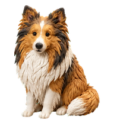
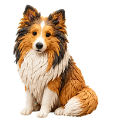
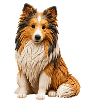
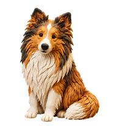
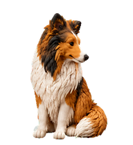
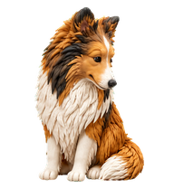
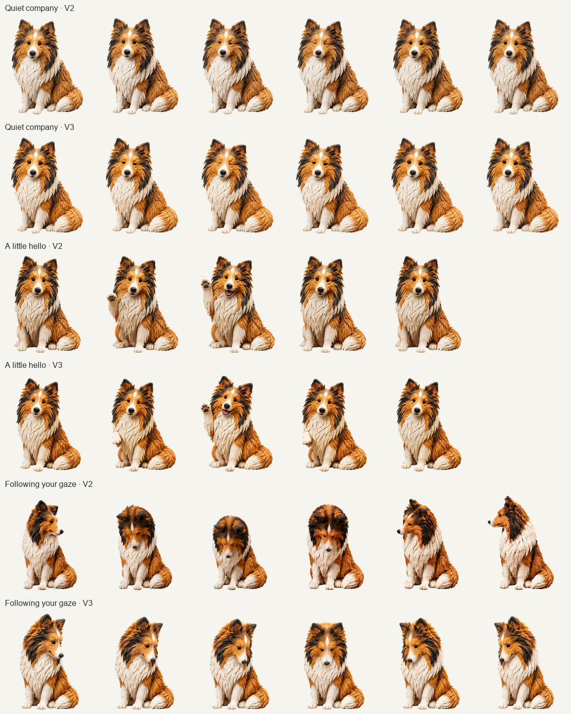

# Flame v3 — Motion Study

A preview of 17 new Flame poses, with the original v2 artwork alongside for comparison. Flame keeps his sculpted-clay coat, long muzzle, white markings, and curled tail.

**[Download the complete preview ZIP](https://github.com/banterle-hash/codex-avatars/releases/download/v3.0.0-preview.1/flame-v3-sample.zip)** · **[Release and individual downloads](https://github.com/banterle-hash/codex-avatars/releases/tag/v3.0.0-preview.1)**

This is a comparison prototype, not an installable pet release. The six head-turn poses are a partial study, not a complete direction row or atlas.

## Animated comparisons

Both versions use the same frame timing. The head-turn study plays forward and back across 112.5°, 135°, 157.5°, 180°, 202.5°, and 225°.

| Study | V2 — current | V3 — candidate |
| --- | --- | --- |
| Quiet company · 6 idle poses |  |  |
| A little hello · 5 greeting poses |  |  |
| Following your gaze · 6 head poses |  |  |

The `jumping` filenames refer to the existing hover animation slot, which Flame uses for his paw greeting.

## Interactive preview

1. Download and extract the ZIP above.
2. Open `flame-v3-sample/preview.html` in a browser.
3. Select a study, pause or step through frames, adjust playback speed, and switch between warm, dark, white, or checker backgrounds.

The [HTML viewer](preview.html) embeds every displayed frame and works offline. GitHub's file view shows its source; download it or the ZIP to run the interactive comparison. The browser viewer synchronizes playback; the inline animations in this README may start independently.

## Every frame

| PNG frame folders | V2 | V3 |
| --- | --- | --- |
| Idle | [6 frames](v2/idle/) | [6 frames](v3/idle/) |
| Paw greeting | [5 frames](v2/jumping/) | [5 frames](v3/jumping/) |
| Head turn | [6 frames](v2/head-turn/) | [6 frames](v3/head-turn/) |

Each cell is 192 × 208 pixels. The [transparent sample sheet](sample-cells.png) contains the 17 candidate poses for inspection; it is not an installable sprite sheet.

## Findings and verification

The head turn shows the strongest improvement: the largest adjacent silhouette-area change in this excerpt fell from about 22.2% to 2.4%. This measures occupied pixels, not perceived animation quality. Idle is modestly steadier; the greeting offers a different expression. The final downward-left poses remain subtle.

All three sample studies passed independent visual review. Every exported playback frame preserves the source PNG alpha and white/dark composites exactly. See the [review and limitations](REVIEW.md), [validation records](qa/), and [generation prompts](generation-prompts.md).

Created with built-in ImageGen and processed with Hatch Pet tools. The exact image model is not exposed, so this sample does not claim a verified model upgrade over v2.
